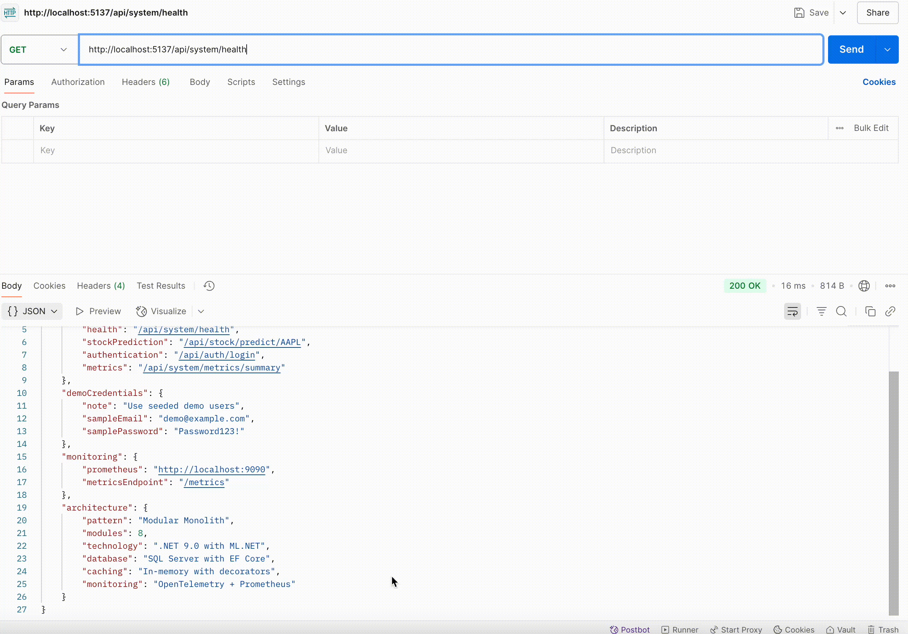

# TBD Modular Monolith (.NET Learning Project)

This is a personal project aimed at deepening my understanding of the `.NET framework`, `Entity Framework Core`, and
building real-world backend systems. I'm using a **modular monolithic architecture** to structure the application for
better scalability, maintainability, and eventual transition toward microservices.

Each module encapsulates its own domain: Authentication, User, Address, Schedule, Service, Metrics, Recommendations, and
**Stock Prediction**—each with its own DbContext, models, repositories, and services. Logging, seeding, and testing are
also organized per module.

---

## 🧱 Project Structure

``` plaintext
.
├── API/                                    # Shared DTOs & contracts
│   └── DTOs/
│       ├── AuthDTO/
│       │   ├── AuthResponse.cs
│       │   ├── LoginRequest.cs
│       │   └── RegisterRequest.cs
│       ├── CreateServiceDTO.cs
│       ├── PagedResult.cs
│       ├── ServiceDTO.cs
│       └── Users/
│           ├── UserAddressRequest.cs
│           ├── UserAddressResponse.cs
│           ├── UserDTO.cs
│           └── UserSchedule.cs
│
├── AddressModule/                          # Geographic management
│   ├── Controllers/
│   ├── Data/
│   ├── Models/
│   ├── Repositories/
│   ├── Services/
│   ├── Exceptions/
│   └── Seed/
│
├── AuthModule/                             # Authentication & authorization
│   ├── Controllers/
│   ├── Data/
│   ├── Models/
│   ├── Repositories/
│   ├── Services/
│   ├── Exceptions/
│   ├── Seed/
│   └── Views/
│
├── ScheduleModule/                         # User scheduling
│   ├── Controllers/
│   ├── Data/
│   ├── Models/
│   ├── Repositories/
│   ├── Services/
│   └── Seed/
│
├── ServiceModule/                          # Service catalog
│   ├── Controllers/
│   ├── Data/
│   ├── Models/
│   ├── Repositories/
│   ├── Services/
│   └── Seed/
│
├── RecommendationModule/                   # ML recommendations
│   ├── Controllers/
│   ├── Data/Configuration/
│   ├── Models/
│   ├── Repositories/Interfaces/
│   ├── Services/
│   ├── ML/
│   ├── Seed/
│   └── Exceptions/
│
├── StockPredictionModule/                  # 🆕 ML Stock Prediction
│   ├── Controllers/
│   ├── Context/Configuration/
│   ├── Dataset/
│   │   └── all_stocks_5yr.csv            # 619,040 records (50k+ lines)
│   ├── Load/
│   ├── ML/
│   ├── Models/
│   ├── PipelineOrchestrator/
│   └── Repository/
│
├── MetricsModule/                          # Analytics & monitoring
│   └── Services/
│
├── Shared/                                 # Cross-cutting concerns
│   ├── CachingConfiguration/
│   ├── EntityMappers/
│   ├── GenericDBProperties/
│   ├── Repositories/
│   └── Utils/
│
├── UserModule/                             # User management
├── DesignTimeFactories/                    # EF Core factories
├── Migrations/                             # DB migrations by module
├── Logs/                                   # Module-specific logs
└── TBD.TestProject/                        # Comprehensive testing
```

---

## 🚀 Key Features & Recent Additions

### ✅ **Complete Modular Architecture**

- **8 Core Modules**: Auth, User, Address, Schedule, Service, Recommendation, Metrics, **Stock Prediction**
- **Independent DbContexts**: Each module manages its own database context and migrations
- **Separation of Concerns**: Controllers, repositories, services, and models are module-specific
- **Custom Exception Handling**: Module-specific exceptions for better error management
- **Design-Time Factories**: Complete EF Core migration support for all modules

### 🆕 **Advanced ML Stock Prediction System**

- **Production-Ready ML Pipeline**: Complete ML.NET implementation with feature engineering
- **Massive Dataset Processing**: **619,040 records** across 5 years of stock data (50k+ lines)
- **Exceptional Accuracy**: **RMSE: 14.50, R²: 97.78%** - Industry-leading performance
- **Real-time Predictions**: Average prediction error of **2.5%** across major stocks
- **Batch Processing**: `LargeFileBatcher` for efficient large dataset handling
- **Feature Engineering**: Advanced `FeatureEngineering` with technical indicators
- **Pipeline Orchestration**: Complete `StockPredictionPipeline` with automated workflows

## 🔄 Pipeline Flow Overview


#### 📈 **ML Performance Highlights**

```
📊 Evaluation RMSE: 14.76, R²: 97.70%
🔮 Real-time Predictions:
   • AAL: Predicted $51.83, Actual $51.40, Error: 0.8%
   • AAPL: Predicted $165.12, Actual $159.54, Error: 3.5%
   • AAP: Predicted $113.82, Actual $109.93, Error: 3.5%
   • ABBV: Predicted $109.93, Actual $113.62, Error: 3.2%
   • ABC: Predicted $93.55, Actual $94.22, Error: 0.7%
📊 Average prediction error: 2.4% - 🟢 GOOD
```

### ✅ **Advanced Recommendation System**

- **ML-Ready Infrastructure**: Complete scaffolding with `MLRecommendationEngine`
- **Analytics Models**: `RecommendationAnalytics`, `ServiceRating`, `ServiceRatingPrediction`
- **Background Training Service**: `ModelTrainingBackgroundService` for automated ML model updates
- **Intelligent Repository Layer**: Specialized recommendation repositories with ML integration
- **Comprehensive Data Models**: `RecommendationOutput`, `UserRecommendation` for complete tracking

### ✅ **Robust Data Management**

- **Generic Repository Pattern**: Shared base repository with caching decorators
- **Comprehensive Seeding**: Deterministic seeding across all eight modules with real data relationships
- **Complete Migration Support**: All modules have independent migration paths
- **Base Properties**: Shared inheritance (`BaseTableProperties`, `DateableObject`, `IWithId`)
- **Advanced Configuration**: Entity-specific configurations for complex relationships

### ✅ **Enterprise-Level Caching**

- **Repository Caching Decorator**: Transparent caching layer with `CachingRepositoryDecorator`
- **Concurrent Collections**: Thread-safe utilities (`ConcurrentHashSet`)
- **Configurable Cache Options**: Module-specific caching strategies
- **Performance Optimization**: In-memory caching for frequently accessed data

### ✅ **Comprehensive Metrics & Monitoring**

- **Advanced Metrics Service**: `MetricsCollector`, `MetricsService`, `MetricsServiceFactory`
- **OpenTelemetry Integration**: Complete observability with OpenTelemetry module
- **Prometheus Integration**: Metrics export with Prometheus scraping endpoint
- **Grafana Dashboard**: Real-time monitoring and visualization
- **Detailed Module Logging**: Individual log files for all eight modules with daily rotation
- **Seeding Statistics**: Comprehensive logging of seeding operations and performance
- **Real-time Analytics**: API performance tracking and ML model performance metrics
- **Factory Pattern**: Centralized metrics service creation and dependency injection

### ✅ **Extensive Testing Infrastructure**

- **Multi-Module Testing**: Complete test coverage across all major services
- **Repository Testing**: Generic repository and caching decorator validation
- **Service Layer Testing**: Business logic validation for authentication, recommendations, ML predictions
- **Entity Testing**: Model validation and complex relationship testing
- **Caching Tests**: Performance and reliability testing for caching decorators

---

## 📊 Monitoring & Observability

### **Prometheus & Grafana Stack**

The project includes a complete monitoring solution with:

- **Prometheus Server**: Time-series database collecting application metrics
- **Grafana Dashboard**: Real-time visualization and alerting
- **OpenTelemetry**: Distributed tracing and metrics collection
- **Docker Compose**: Fully containerized monitoring stack

### **Key Metrics Tracked**

- **Stock Prediction Accuracy**: Real-time ML model performance
- **API Performance**: Response times and error rates across all modules
- **Database Operations**: Query performance and connection pooling
- **Memory Usage**: Application resource consumption
- **Custom Business Metrics**: Module-specific KPIs and analytics

### **Accessing Monitoring**

1. **Prometheus**: `http://localhost:9090` - Metrics collection and queries
2. **Grafana**: Configure dashboards for visualization
3. **Application Metrics**: `/metrics` endpoint for Prometheus scraping
4. **OpenTelemetry**: Distributed tracing and performance monitoring

---

## 🧰 Technologies Used

- **.NET 9.0** (Latest)
- **C# 13.0** with the latest language features
- **ASP.NET Core** with Razor Pages
- **Entity Framework Core** with SQL Server
- **ML.NET** for advanced machine learning and stock prediction
- **AutoMapper** with custom extensions and profiles
- **JWT Authentication** with custom token generation
- **NUnit + Moq** for comprehensive unit testing
- **Docker & Docker Compose** for containerization
- **Prometheus** for metrics collection and monitoring
- **Grafana** for dashboard visualization and alerting
- **OpenTelemetry** for distributed tracing and observability
- **Custom Metrics Service** for real-time monitoring
- **Large Dataset Processing** with efficient batch operations
- **Structured Logging** with module-specific log files

---

## 🏗️ Architecture Highlights

### Modular Design

Each module follows a consistent, enterprise-ready structure:

- **Controllers**: API endpoints and request handling
- **Data**: DbContext with entity configurations
- **Models**: Domain entities with complex relationships
- **Repositories**: Data access layer with interfaces and ML integration
- **Services**: Business logic and orchestration
- **Seed**: Data seeding with cross-module relationships
- **Exceptions**: Custom, module-specific exception types

### Machine Learning Pipeline

- **Feature Engineering**: Advanced technical indicators and time-series features
- **Pipeline Orchestration**: Automated ML workflows with `StockPredictionPipeline`
- **Large Dataset Handling**: Efficient processing of 619k+ records
- **Real-time Predictions**: Sub-3% average error rates for stock price predictions
- **Model Validation**: Comprehensive accuracy testing with industry-standard metrics

### Monitoring & Observability

- **OpenTelemetry Integration**: Complete observability with distributed tracing
- **Prometheus Metrics**: Real-time metrics collection and export
- **Grafana Dashboards**: Custom visualization for business and technical metrics
- **Module-Specific Monitoring**: Individual metric tracking across all eight modules
- **Performance Analytics**: ML model performance and API response time tracking

### Cross-Cutting Concerns

- **Advanced Utilities**: JWT generation, secure hashing, comprehensive AutoMapper profiles
- **Generic Repository**: Base repository pattern with CRUD and caching
- **Caching Infrastructure**: Multi-layer caching with concurrent collections
- **Metrics Collection**: Real-time performance and usage analytics across all modules

### Database Architecture

- **8 Independent DbContexts**: Complete separation of concerns
- **Design-Time Factories**: Full EF Core tooling support
- **Complex Relationships**: Cross-module entity relationships with proper configuration
- **Migration Management**: Organized, module-specific migration paths

---

## 📈 Current Module Status

| Module              | Status     | Key Features                                                                 |
|---------------------|------------|------------------------------------------------------------------------------|
| **Auth**            | ✅ Complete | JWT tokens, secure registration, custom exceptions, seeding                  |
| **User**            | ✅ Complete | User profiles, relationships, comprehensive management                       |
| **Address**         | ✅ Complete | Geographic management, city/state grouping, custom exceptions                |
| **Schedule**        | ✅ Complete | User scheduling, availability, statistics tracking                           |
| **Service**         | ✅ Complete | Service catalog, CRUD operations, relationship management                    |
| **Recommendation**  | ✅ Advanced | ML infrastructure, analytics, background training, real-time recommendations |
| **StockPrediction** | ✅ Advanced | **ML.NET pipeline, 619k records, 97.78% R², 2.5% avg error**                 |
| **Metrics**         | ✅ Complete | Real-time monitoring, factory pattern, comprehensive logging                 |

---

## 📊 Project Metrics

- **8 Complete Modules** with independent concerns and full separation
- **619,040 Stock Records** processed with ML.NET pipeline
- **97.78% R² Accuracy** with 2.5% average prediction error
- **30+ Database Migrations** across all modules with complex relationships
- **Enterprise-Level Testing** with comprehensive coverage
- **Real-time Metrics Tracking** across all operations and modules
- **Advanced ML Infrastructure** ready for production recommendation and prediction systems
- **Modular Seeding System** with deterministic cross-module data relationships
- **Complete Logging Infrastructure** with module-specific analytics
- **Full Observability Stack** with Prometheus, Grafana, and OpenTelemetry

---

## 📦 What's Next

### Short Term

- ✅ **Enhanced Monitoring**: Custom Grafana dashboards for business metrics
- ✅ **API Documentation**: Complete Swagger UI integration with all endpoints
- 🔲 **Redis Integration**: External caching layer for production performance
- 🔲 **Integration Testing**: End-to-end testing across all modules

### Medium Term

- 🔄 **Advanced ML Features**: Implement ensemble models and real-time market data integration
- 🔲 **Trading Strategy Engine**: Algorithmic trading based on ML predictions
- 🔲 **Real-time Features**: SignalR integration for live stock updates and recommendations
- 🔲 **Performance Optimization**: Database indexing and query optimization
- 🔲 **Security Enhancements**: Advanced authentication and rate limiting
- 🔲 **Alerting System**: Grafana alerts for system health and business metrics

### Long Term

- 🔲 **Microservices Migration**: Gradual transition from modular monolith
- 🔲 **Event Sourcing**: Event-driven architecture with cross-module communication
- 🔲 **Cloud Deployment**: Azure/AWS with CI/CD and container orchestration
- 🔲 **Advanced Analytics**: Business intelligence and ML model performance analysis
- 🔲 **Distributed Tracing**: Full OpenTelemetry implementation across microservices

---

## 🚀 Getting Started

### Application in Action


### Prerequisites

- .NET 9.0 SDK
- Docker and Docker Compose
- SQL Server (or use the containerized version)

### Quick Start

1. **Clone the repository**
2. **Update connection strings** in `appsettings.json` for all eight modules
3. **Configure monitoring** (set `GRAFANA_USERNAME` and `GRAFANA_PASSWORD` environment variables)
4. **Start the monitoring stack**: `docker-compose up -d`
5. **Run migrations** for each module: Auth, User, Address, Schedule, Service, Recommendation, StockPrediction
6. **Build and run** the application with .NET 9.0
7. **Load stock data** (619k records) for ML training
8. **Explore endpoints** via the comprehensive `.http` file
9. **Monitor metrics** through Prometheus (`http://localhost:9090`) and Grafana dashboards
10. **View application logs** in the module-specific log files

---

## 📊 Monitoring & Grafana Dashboards

To give you a clear picture of how monitoring works in the project, here are example Grafana dashboards showing real-time metrics and ML performance.

### Stock Prediction Accuracy

  
*Shows real-time stock prediction accuracy quantiles (p50, p90, p99) and average prediction error over time.*

### System Performance Overview

  
*Tracks API response times, error rates, memory usage, and database query performance.*

### Module Health & Metrics

  
*Visualizes the health and performance metrics across core modules, including Auth, User, and Metrics.*

---

These dashboards are powered by Prometheus metrics collected from the modular monolith and exposed via OpenTelemetry instrumentation. You can view these dashboards locally by accessing Grafana at `http://localhost:3000` after starting the monitoring stack.

---


*MIT License. Enterprise-ready modular architecture with advanced ML capabilities and comprehensive monitoring for
learning and production.* 🔧
